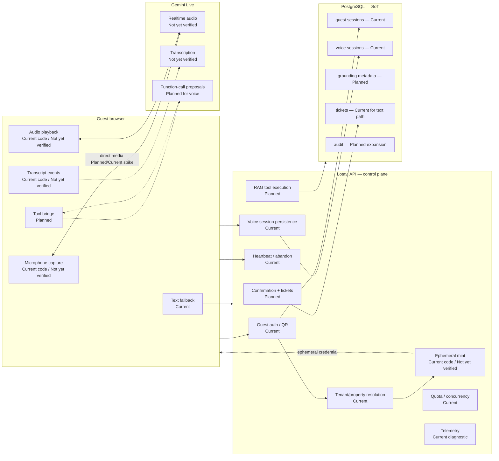

# Lotavi voice architecture

**Canonical ADR:** [ADR-direct-gemini-live-browser](../architecture/adr/ADR-direct-gemini-live-browser.md)  
**Status:** [current-status.md](./current-status.md)

## Distinctions

| Label | Meaning |
|-------|---------|
| **Current** | Present in the codebase today |
| **Planned** | Target architecture; not fully built |
| **Not yet verified** | Needs real provider/device/network proof |

## Canonical wording

### Current implementation

- Voice safety foundation is implemented.  
- Voice sessions are persisted and ownership-checked.  
- Direct Gemini browser capability code exists.  
- Real provider and device verification remain blocked.  
- Voice is disabled by default.  
- No voice RAG or write tools are enabled.  
- The Lotavi backend is **not** a working Gemini media relay.  
- `GeminiLiveAdapter` is a control-plane / placeholder-shaped adapter, not a verified Live media session.

### Target architecture

- Realtime voice **media** travels directly between the guest browser and Gemini Live.  
- Lotavi remains the **control plane** for authentication, tenant/property scope, token minting, quota, RAG tools, confirmed actions, persistence, audit and telemetry.  
- Text chat continues through the Lotavi backend.  
- PostgreSQL remains the source of truth for business actions.  
- The browser is untrusted and never supplies authoritative tenant or property scope.  
- Gemini may propose actions but cannot persist tickets directly.  
- Consequential actions require server validation and explicit guest confirmation.

## Text path (current + target)

```text
Guest browser
  → Lotavi API
  → RAG / Gemini (server-mediated)
  → Browser
```

## Voice media path (target; capability code current; provider verification blocked)

```text
Guest browser
  ← short-lived ephemeral credential — Lotavi API
  ↔ Gemini Live (direct WebSocket / audio)
```

## Voice control plane (current + planned expansion)

```text
Guest browser
  → Lotavi API:
      guest authentication
      QR / session validation
      tenant / property resolution
      ephemeral credential minting
      allowlist enforcement
      quota and concurrency
      session persistence
      heartbeat
      audit / telemetry
      [Planned] RAG tools
      [Planned] confirmed business actions
```

## Mermaid — canonical system view



## Component truth table

| Component | Role today | Notes |
|-----------|------------|-------|
| `GeminiLiveAdapter` | Placeholder / canonical event shaping for relay path | **Not** a working media relay |
| `POST …/direct/ephemeral` | Mint path (server key) | Runtime provider smoke **BLOCKED** |
| `VoiceDirectSpike` | Dev/staging experimental UI | Not a production surface |
| Relay WebSocket `/voice/ws` | Ownership-gated control channel | Does not stream real Gemini audio today |
| Text chat | Server RAG path | Operational fallback |

## Observability classes

| Class | Examples | Billing? |
|-------|----------|----------|
| Implemented diagnostic metrics | mint totals, session ended, heartbeat | No |
| Client-reported | first-audio latency, transcript received flags | No |
| Provider-verified | real connect/audio proof | Not yet |
| Billing-authoritative | provider usage reconciliation | **Not implemented** |

Browser-reported duration and transcript events are **not** authoritative billing data.
